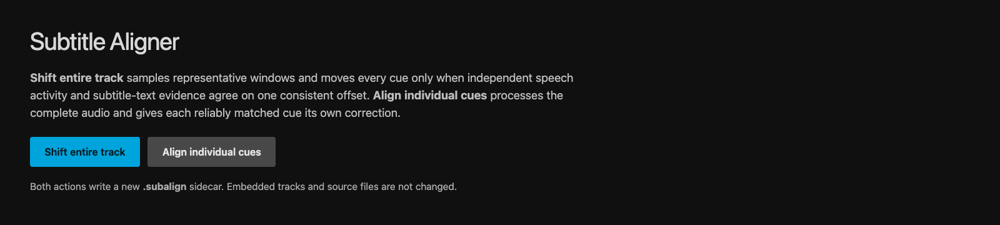
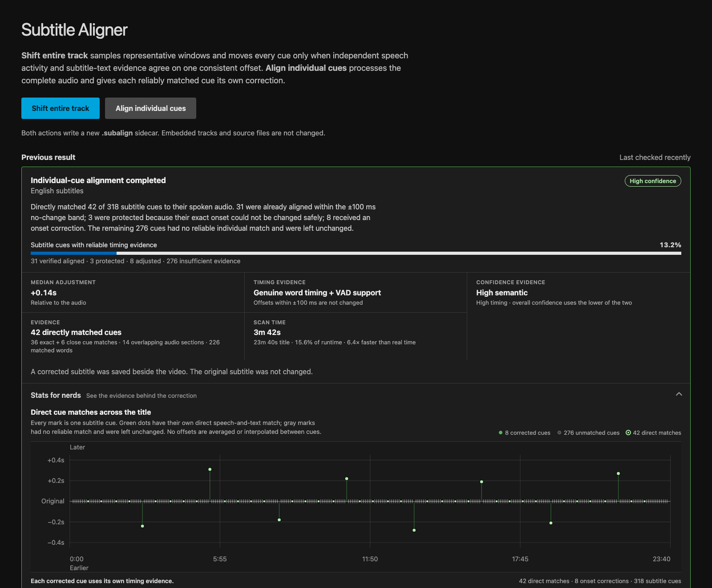

# Subtitle Aligner for Jellyfin

Subtitle Aligner checks text subtitles against the spoken audio and can create a corrected sidecar when their timing is wrong. It adds two actions to Jellyfin's subtitle editor: one for a consistent whole-track offset and one for cue-by-cue alignment.

Source media and source subtitles are not modified. Corrections are written to a separate `.subalign` sidecar beside the video.



## Features

- Shift an entire subtitle track when sampled evidence agrees on one offset.
- Align individual cues against a full transcription of the title.
- Handle SRT, WebVTT, ASS, SSA, and `mov_text` subtitle streams.
- Use a bundled local Whisper engine on Linux x86-64 or a compatible external speech server.
- Show progress, estimated time remaining, confidence, scan cost, and cue-level evidence in Jellyfin.
- Cache validated speech responses for faster deterministic reruns.
- Scan external subtitle sidecars automatically during an optional run window.
- Keep every correction reviewable and separate from the source files.

## Compatibility

| Component | Supported version or format |
| --- | --- |
| Jellyfin Server | 12.0.0 ABI |
| Plugin runtime | .NET 10 |
| Bundled speech engine | Linux x86-64 |
| External speech services | whisper.cpp `/inference` or OpenAI-compatible transcription and translation endpoints |
| Subtitle formats | SRT, WebVTT, ASS, SSA, and embedded `mov_text` |

The bundled engine is available only for Linux x86-64. Other Jellyfin platforms can use a compatible local executable or an external speech server.

## Installation

Subtitle Aligner is not yet available in the official Jellyfin plugin catalog.

1. Download the archive for your Jellyfin version from [Releases](../../releases).
2. Extract it into a new directory inside Jellyfin's plugin directory.
3. Restart Jellyfin.
4. Open **Dashboard → Plugins → Subtitle Aligner**.
5. Install a recommended model or configure an external speech server.

Plugin builds are tied to a Jellyfin ABI. If Jellyfin reports the plugin as unsupported, install a release whose `targetAbi` matches your server.

## Usage

Open a movie or episode, choose **Edit subtitles**, then select one of the Subtitle Aligner actions.

### Shift entire track

This is the fast option for subtitles that are early or late by the same amount throughout the title. It samples representative sections, compares subtitle text and speech activity independently, and moves the track only when both signals agree on one high-confidence offset.

Drift, timing breaks, weak evidence, and conflicting matches are reported without changing the subtitle. When the offset varies through the title, the result recommends **Align individual cues**.

Automatic library scans use this mode and inspect external sidecars only.

### Align individual cues

This option processes the complete audio and evaluates each dialogue cue separately. A cue is changed only when it has its own reliable speech-and-text match; unmatched cues keep their original timing. Corrections are not averaged or copied between cues.

Same-language alignment uses word timing. English subtitles over non-English speech require a speech service that supplies the additional timing and provenance described in the [speech service contract](docs/speech-service-contract-v1.md). The plugin leaves a cue alone when the required evidence is missing or ambiguous.

See [How alignment works](docs/alignment.md) for the matching rules, timing targets, and cross-language safeguards.



*The result shown above uses illustrative data.*

## Configuration

The settings page recommends a compatible managed model from the host architecture, CPU features, and available memory. Its optional benchmark measures speed only; it does not select a model or measure accuracy.

An external server can move inference work off the Jellyfin host. OpenAI-compatible requests use `model=auto` and include the source language when Jellyfin knows it. Configure only a server you trust: extracted audio is sent to that server, and standard whisper.cpp does not provide client authentication.

Validated speech responses are cached in Jellyfin's plugin data directory. The default policy keeps unused entries for seven days and limits the cache to 2 GB using least-recently-used eviction. Administrators can change those limits, clear the cache, or request a fresh transcription for one run. Extracted WAV files are temporary and are not stored in the cache.

The plugin starts its bundled speech process only while work is running. It listens on a random loopback port and is stopped after the run.

## Safety

- Media containers and source subtitle files remain unchanged.
- A corrected sidecar is replaced only when its saved hash shows that Subtitle Aligner created it.
- A cue without reliable individual evidence is left at its authored timing.
- Non-dialogue roles such as signs, typesetting, songs, and karaoke are excluded from individual-cue correction.
- Contract errors and caller cancellation fail closed instead of silently using lower-quality timing.
- Sidecar creation is disabled by default so a first run can be report-only.

Users with Jellyfin's **Allow this user to edit subtitles** permission can run the title actions. Plugin configuration remains administrator-only.

## Troubleshooting

- **Run buttons are disabled:** install a compatible model, set a readable custom model path, or configure an external server.
- **A sidecar cannot be created:** Jellyfin needs write access to the media directory. Administrators and subtitle managers see the full error in the result.
- **An external server test fails:** check the URL, port, firewall, and supported API. The URL must be absolute HTTP or HTTPS and cannot contain credentials.
- **A rerun should ignore the cache:** select **Retranscribe audio for this run**, or clear cached speech analysis in the advanced engine settings.

## Support

Subtitle Aligner is a personal project provided as-is, without support or warranty. Issues are disabled and pull requests are limited to existing repository collaborators. You may fork and adapt the project under GPL-3.0; modified distributions should use a different project name and branding.

The plugin depends on version-specific Jellyfin APIs and speech-service behavior that may change. Undocumented Jellyfin versions, platforms, inference services, and media configurations are outside this project's scope.

## Build

The managed plugin requires the .NET 10 SDK:

```sh
dotnet restore Jellyfin.Plugin.SubtitleAligner.slnx
dotnet build Jellyfin.Plugin.SubtitleAligner.slnx --configuration Release --no-restore
```

A complete Linux x86-64 release archive also needs the checksum-pinned `whisper-server` binary:

```sh
./build.sh /path/to/whisper-server
```

See [CONTRIBUTING.md](CONTRIBUTING.md) for the test suite, speech-service conformance checks, and reproducible native build.

## License

Subtitle Aligner is an independent project and is not affiliated with the Jellyfin project.

It is licensed under GPL-3.0. The packaged inference engine and its components retain their own licenses; see [THIRD-PARTY-NOTICES.md](THIRD-PARTY-NOTICES.md), [LICENSE-whisper.cpp](LICENSE-whisper.cpp), and [LICENSE-musl](LICENSE-musl).
